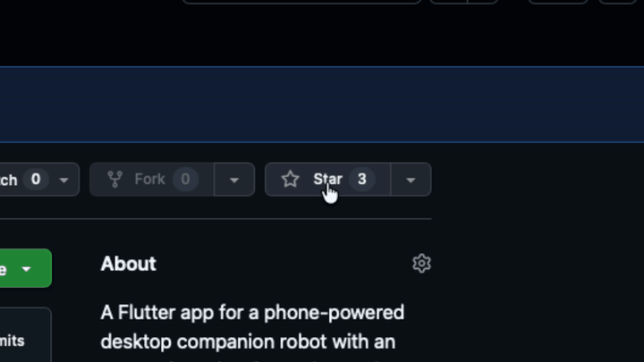

  <a href="../README.md">中文</a> | English

  

<h1 align="center">MotaAI「MobileAiAgent」</h1>

  
  
  

  A Mota mobile AI agent app with conversation, connection, and interaction flows.

<table>
  <tr>
    <td width="58%">
      
    </td>
    <td width="42%" align="center">
      <strong>如果你对我们的项目感兴趣，求一个小小的 Star 作为支持。</strong> 
      If you like our project, a small Star would mean a lot to us.
    </td>
  </tr>
</table>

## Quick Preview

  
  
  

---

## Quick Project Structure

For a fast walkthrough of the repository layout and Dart core modules, see [Project Structure](project-structure/README.md).

## Mobile Application

Flutter client: [`MobileApplication`](../MobileApplication).

---

## Star History

<picture>
  <source media="(prefers-color-scheme: dark)" srcset="https://api.star-history.com/chart?repos=IwakuraRin/MotaAI-MobileAgent&type=date&theme=dark&legend=top-left" />
  <source media="(prefers-color-scheme: light)" srcset="https://api.star-history.com/chart?repos=IwakuraRin/MotaAI-MobileAgent&type=date&legend=top-left" />
  
</picture>

[Live chart](https://www.star-history.com/IwakuraRin/MotaAI-MobileAgent)
